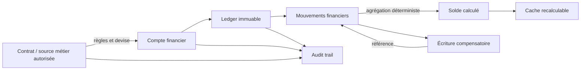

# FIN-ARCH-001 — Financial Domain Reference Architecture

## Objectif

Définir une architecture de référence générique pour les projets qui manipulent des objets financiers critiques, sans imposer un secteur métier, un langage, une base de données ou un fournisseur.

## Entités conceptuelles

* **Contrat** : source métier autorisée des engagements, règles et devise de référence.
* **Compte financier** : périmètre cohérent auquel sont rattachés les mouvements.
* **Ledger** : journal ordonné et immuable constituant la source de vérité financière.
* **Mouvement financier** : écriture atomique, signée par son contexte métier et sa devise.
* **Solde calculé** : résultat déterministe de l'agrégation des mouvements applicables.
* **Écriture compensatoire** : mouvement inverse ou correctif lié explicitement à une écriture antérieure.
* **Audit trail** : trace séparée des acteurs, systèmes, commandes, décisions et accès.

## Schéma de référence

## Séparation des responsabilités

* Les données métier décrivent les engagements et autorisent les opérations ; elles ne remplacent pas le ledger.
* Les mouvements financiers enregistrent les effets monétaires validés et restent immuables.
* Les soldes calculés sont des projections déterministes du ledger.
* Les caches accélèrent les lectures, sont identifiés comme dérivés et peuvent être reconstruits.
* Les journaux d'audit expliquent qui ou quel système a demandé, autorisé, exécuté ou consulté une opération. Ils ne se substituent pas aux mouvements financiers.

## Recommandations API

* Exposer des commandes métier explicites telles que paiement, remboursement, ajustement ou compensation, plutôt qu'une mise à jour générique de solde.
* Exiger une clé d'idempotence stable pour les commandes rejouables.
* Retourner l'identifiant du mouvement, son état, son montant, sa devise et sa référence métier.
* Interdire les opérations génériques de modification et suppression sur les mouvements validés.
* Utiliser un contrôle de concurrence explicite et des erreurs stables pour conflit, doublon, devise incompatible et solde insuffisant.
* Séparer les autorisations de lecture, d'initiation, d'approbation, de compensation et d'administration.

## Recommandations base de données

* Utiliser un type décimal à précision fixe ou des unités monétaires mineures ; ne pas utiliser de flottant binaire.
* Stocker explicitement le montant, la devise et la précision applicable.
* Garantir l'unicité des identifiants, références pertinentes et clés d'idempotence.
* Protéger les mouvements validés contre les mises à jour et suppressions, y compris dans les procédures d'exploitation.
* Lier les compensations par contraintes référentielles et conserver l'ordre temporel.
* Distinguer tables de ledger, projections de solde, caches et audit trail.
* Concevoir migrations, sauvegardes, restauration et archivage sans casser la chaîne d'audit.

## Recommandations tests

* Tester paiements totaux et partiels, remboursements, ajustements, compensations et doubles soumissions.
* Tester le recalcul complet et le rapprochement avec les projections ou caches.
* Tester les courses concurrentes, reprises après échec et garanties d'idempotence.
* Tester les limites de précision, arrondis, montants négatifs interdits ou autorisés et changements de devise.
* Tester migrations et rollback avec des données financières représentatives et anonymisées.

## Recommandations sécurité

* Appliquer moindre privilège, séparation des fonctions et authentification forte selon le risque.
* Chiffrer les flux et les données sensibles selon leur classification.
* Éviter les montants, références sensibles et données personnelles dans les logs non protégés.
* Protéger l'intégrité et la rétention de l'audit trail ; superviser les tentatives de modification.
* Journaliser les accès privilégiés, compensations, exports, échecs d'autorisation et anomalies de rapprochement.

## Conformité

La conformité est évaluée avec `ADR-FIN-001` et `CHECK-FIN-01`. Toute dérogation est documentée, limitée dans le temps, approuvée par les rôles responsables et inscrite dans le registre des décisions.
